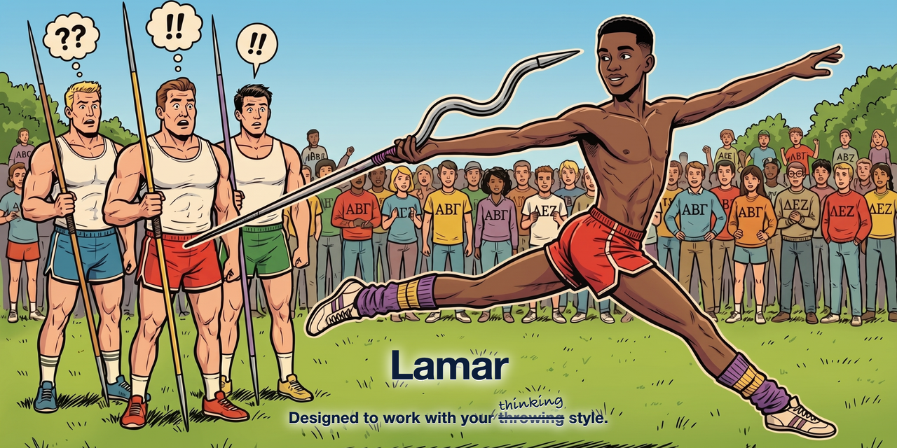

  

# Lamar

> Designed to work with your ~~throwing~~ *thinking* style.

Lamar is an interview-driven spec tool. It talks with you, asks the right questions, and produces a
build-ready `ralph.md` so the building can be automated — shaping the spec around **how you think**
instead of forcing you into a fixed PRD format. It meets three kinds of people where they are:

- **Knows what they want, but not how to build it** — Lamar draws out the spec in plain terms.
- **A strong technical spec already** — Lamar challenges assumptions and stress-tests it.
- **A complete novice** — Lamar walks through the tradeoffs and nails down the spec before building.

## Why "Lamar"?

Named after **Lamar Latrelle** in *Revenge of the Nerds* (1984). In the Greek Games javelin event,
the nerds don't retrain Lamar's throw — they **engineer a javelin around his throwing style**, and it
whips down the field to win. Same idea here: the tool adapts to your style instead of making you adapt
to it.

> "Wormser's a master at aerodynamics, and he designed the javelin to go along with Lamar's
> limp-wristed throwing style." … "Wormser! **It worked!**"
> — *Revenge of the Nerds* (1984)

## Status

🚧 **In development.** This repo currently holds the brand assets; the skill implementation is coming.

## Brand assets

See [`assets/brand/`](assets/brand/) — full spec, sizes, and regeneration notes in
[`assets/brand/BRAND.md`](assets/brand/BRAND.md). Highlights:

- `repo-card-1280x640.png` — social card / README banner
- `promo-video.mp4` — short promo clip
- `icon-javelin-mark.png` + `favicon-*` — favicon; `icon-character-badge.png` — avatar
